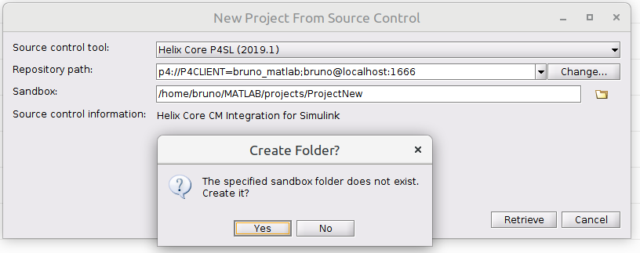

[](mailto:support@perforce.com)

# P4SL 

## Overview
P4SL is a P4 Plugin for Simulink and Matlab.

## Requirements
- Matlab 2017b or higher.	

- P4 server at Release 2017.1 or higher.

- Java: full standard JDK 8 or later.  Implementation as discussed in "Known Limitations" below.

- SSL: unlimited strength JCE (Java Cryptography Extension) package for 256-bit encryption level SSL connection to a secure P4 server.

- P4Java 2020.1 has changed the default TLS support to TLSv1.2 for use with P4 server 2019.1 or greater this can be modified using the JVM option: ``java -DsecureSocketEnabledProtocols=TLSv1.2``

## Known Limitations

For Java versions prior to JDK 7, P4SL does not correctly implement or deal with Unix / Linux and Windows symbolic links.
This is a known issue related to older (prior to JDK 7) versions of Java's inability to itself implement symbolic links.

The P4 server (2015.1 or higher) only supports 256-bit encryption.  Due to current US export control restrictions
for some countries, the standard JDK package only comes with 128-bit encryption level ciphers.  In order to use P4SL to
connect to a secure P4 server, those living in eligible countries may download the unlimited strength JCE (Java
Cryptography Extension) version and replace the current default cryptography jar files with the unlimited strength files. 

These files are located at:

``<java-home>/lib/security/local_policy.jar``

``<java-home>/lib/security/US_export_policy.jar``

## Documentation
For more information please refer to the [P4 Plugin for MATLAB and Simulink (P4SL) Guide](https://www.perforce.com/manuals/p4sl/Content/P4SL/Home-p4SL.html)
## Support

This project is maintained by P4 Engineering and fully supported.  Pull requests will be managed by P4's engineering teams.  We will do our best to acknowledge these in a timely manner based on available capacity.  Issues will not be managed on GitHub.  All issues should be recorded via P4's standard support process (https://www.perforce.com/support/request-support).

## Installation

You can easily install P4 plugin by downloading the P4SL matlab toolbox file from the [P4 website](https://www.perforce.com/integrations).

NOTE: If you installed an earlier version of P4SL using a jar file, you must edit the classpath.txt file to delete 
the P4 Integration lines and restart MATLAB before you install P4SL.

1. Start Matlab. Click *Open* then *Open....*  


2. Locate the P4SL.mltbx file (most likely found in your _Downloads_ folder). And click _Open_. You will see a message saying "Installation Complete". Click _Finish_.

3. The Plugin will be displayed as Installed in the Add-On Manager.   


4. To View the Plugin's information, click on the three vertical dots on the right and click _View Details_.  


5. Restart Matlab.

6. For Simulink projects: check that P4 is loaded by going to:
      `New > Projects > From Source Control`
      and looking for P4 as one of the options in the drop-down.

Alternately, you can install the plugin the old way by editing the `classpath.txt` file.
You will need to download the *p4sl jar* file from [P4 website](https://www.perforce.com).

1. Start Matlab.  
NOTE: Windows users may need to run MatLab as an administrator to make changes
to the `classpath.txt` file.  


2. In the command window enter (without quotes): "edit classpath.txt".  


3. Scroll to the bottom, and add the absolute path to your P4Simulink file.  


4. Save the file, and *restart* Matlab.

5. For Simulink projects: check that P4 is loaded by going to:
   `New > Projects > From Source Control`
   and looking for P4 as one of the options in the drop-down.

## Connecting to P4

The P4 integration uses a `.p4config` file in a project's root directory
("sandbox" in Simulink) to store the user name, port, and (client) workspace.

For non Simulink projects you *MUST* create a `.p4config` file the root directory
of your project/work area.

For an existing Simulink project: if a `.p4config` file is present, it is automatically 
loaded.

If you are creating a Simulink project from scratch, the .p4config may not be present. 
You can follow these steps and a Connection Dialog will prompt for the connection fields and a
.p4config file will be written.

Sample `.p4config` file:

```
P4USER=username
P4PORT=perforceserver:1666
P4CLIENT=workspacename
```

The three values are enough for the P4 integration to attempt to 
connect to the P4 server. Once connected, a password will be requested
if required. If the specified workspace does not exist, P4Simulink will
attempt to create it by prompting you for a depot path. The client's root
will be set to the sandbox root (given in the Simulink project creation
window). A default view will be created, where DEPOT_PATH is the path
entered at the prompt, and CLIENT_NAME is the specified workspace name:

    //DEPOT_PATH/... //CLIENT_NAME/...


## Simulink Quick Start
### New Project from scratch
To create a new Simulink Project select *New*, *From Simulink Template*, then *Create Project* on *Simple Project*.


You will see a dialog like one below.


Click on the folder icon to create a new folder (name is not editable).


In the *Project* tab click on *Use Source Control*, then *Add Project to Source Control...*


Select P4 from the Source Control Tool drop-down, then click *Change...*


Fill in the details, then click *Connect*. Upon successful connection, click *Ok*, then click *Convert*.
Edit the View Mapping and click *OK*.


Click *OK* on the Get Revision dialog and you will see P4 icons on the project files.
In the *PROJECT* tab, click *Commit* and add the project to P4.


### Project from Source Control

To create a new Simulink Project select _New_, _Project_, then _From Simulink Template_ Or click on the *Simulink* icon on the menu bar. You will see the screen below.


Click on _Project from P4_ or select _P4_ from the _Projects_ --> _From Source Control_ dropdown.

Set the _Sandbox_ path to the location on your local machine to populate with the versioned files.  The specified path will your P4 Workspace __root__.


Next, set the _Repository path_, this requires a P4 URI.  Click on the _Change..._ button to open a Connection Dialog to help generate the URI.

Provide the Server, Username and Workspace and click _Connect_ to validate and generate the URI, then _OK_ to set the URI.


Click on the _Retrieve_ button to start the process of fetching the files from P4.  If the sandbox directory does not exist, you will be prompted to create it, select _Yes_.



If you do not already have a valid ticket session with P4, you will be prompted for your password...


If the Workspace specified in your connection does not exist you will be prompted to create one.  Fill out the P4 Workspace setting, Stream or View as needed and click _OK_ to save.


Next, the plugin will request what changed to populate the workspace.  Select the change as needed, typically _Get latest revision_ is required.  Select _OK_ and P4 will sync the specified files to your local MatLab sandbox.


Simulink will prompt you to create a Project, select _Yes_.


You will see a _Let's get started!_ popup. Click _Set Up Project_ button.


To add the project files to Simulink, click on _Add Folder..._ or _Add with Subfolders..._. When you click on _Add Folder..._, you will be prompted to select the folders you want to add to the project.

You can specify project files to automate startup tasks in step 2 as below.


You can still add files and folders to your project by selecting the folder/file to add. Select all the files and directories to add to Simulink, then right click and select _Add to Project_ or _Add Folder to Project (Including Child Files)_ as needed.

The file Status will now indicate a green tick...  


Simulink will have created/updated project files on account of the change, under _Modified Files_. To submit these back to P4, open the _Current Folder_ view, right click, select _Source Control_ and click _View and Commit Changes..._. 


... and provide a change description.


## MatLab Only Quick Start

You *MUST* have already created a `.p4config` file as discussed in 
Installation section and created your P4 client workspace using
one of our clients e.g. command line `p4` or GUI `P4V` client.

MatLab automatically picks up the P4 configuration as you
navigate files on your system.


The 'P4' column will indicate the file's state using a green circle 
(up-to-date) and blue square (edit) and so on...

Use the (right click) context menu -> 'Source Control' on the file or folder 
to apply P4 actions.


## Notes 

1. Clicking "Add to Project" will add the specified file(s) to the
Simulink project, and open the file for add locally. The file(s) will show
up under "Modified Files" and you must commit (submit) the file in order
to complete the process.

2. Clicking "Source Control --> Get File Lock" will open the specified file(s) for edit
within P4. The file(s) will show up under "Modified Files" and you
must commit (submit) the file in order to complete the process.

3. Editing a file without clicking "Get File Lock" will do nothing
unless the file is saved. Once the file has been saved and the Overwrite
button is clicked (because P4 keeps local files as read-only by
default) the file will be opened for edit.

4. Clicking "Get File Lock" will first retrieve the latest version of the
file before opening it for edit.

5. "Remove from Project" will commit the remove action, but will *not*
delete the local file.

6. Compare against another revision will use the "p4 print" command to
stream the non-head revision to the user's machine. Local files are not
updated.

## Distribution

### Directory Structure:

```
P4Simulink
|- gradle                   Gradle build scripts
|- libs                     Simulink SCM API jar files                     
|- p4-bin                   P4D binaries used during tests
|- release                  Built JAR file
|- src
|  |- test                  Source code for functional tests
|  |- main                  Source code for the P4Simulink integration
```

## Building P4Simulink:

### Prerequisites:

You must have the following installed on the system on which you want to
build the integration:

  * JDK 1.7+
  * Gradle 2.0+

Note that gradle will download all required external dependencies as part
of the build process.

### Tests

Running the functional tests can be done via the gradle wrapper:

`./gradlew clean test`

The included tests start up a p4d instance, restore some data from checkpoint
and then run the P4Simulink functional tests against this instance. It runs
on localhost:1999.

### Building

Building the jar is done via the 'build' gradle target. Note that the process
builds a "fat" jar in that all dependent jars are included in the end result.

`./gradlew -Pver=VERSION clean build`

(`VERSION` uses the pattern REL.CHANGE e.g. `2015.1.123456`)

The target jar will appear in `build/libs/` and should follow the pattern:

`p4sl-VERSION.jar` where VERSION is the version number and set to "0" if unspecified.